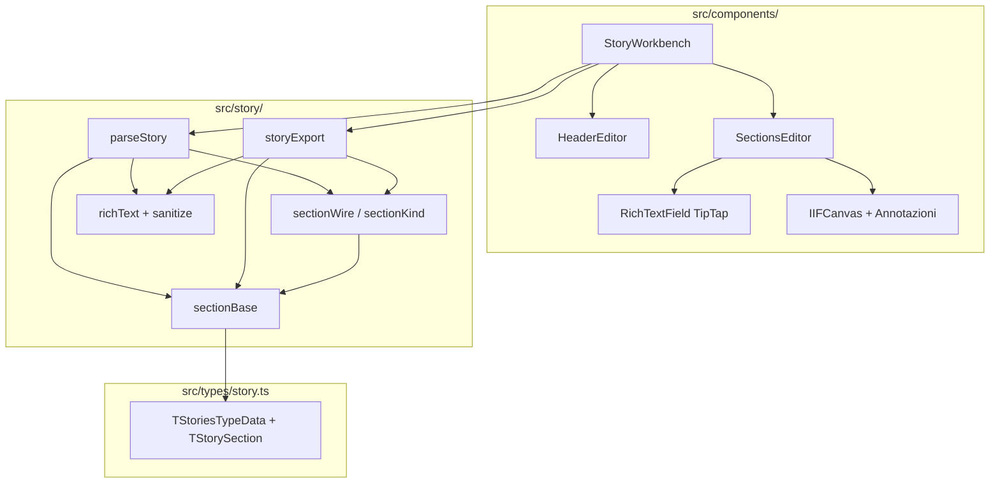

# Report di analisi — Generatore Stories

**Data:** 9 giugno 2026 (aggiornato 12 giugno 2026 — `sectionBase`)  
**Progetto:** Generatore Stories (editor React per file JSON delle Stories IARTNET)

Editor React per creare e modificare file JSON delle **Stories IARTNET** (`TStoriesTypeData` / `ext_json`), pensato per operatori editoriali del museo/Accademia di Brera. Non è un CMS completo: è uno **strumento offline-first** che produce JSON compatibile con un viewer Vue downstream.

---

## 1. Obiettivo e contesto

| Aspetto | Valutazione |
|---------|-------------|
| **Scopo** | Chiaro e ben delimitato |
| **Utente target** | Redattori / curatori che gestiscono contenuti narrativi con immagini IIIF |
| **Integrazione ecosistema** | Tool satellitare: import/export JSON, nessuna API IARTNET |

Il README documenta il modello sezioni (`TStorySectionBase`), la migrazione del testo ricco (`string[]` → HTML) e i moduli coinvolti. L'app fa una cosa sola, ma la fa in profondità.

---

## 2. Stack tecnologico

| Layer | Tecnologia | Note |
|-------|------------|------|
| UI | React 19, react-bootstrap 2 | Stack moderno |
| Build | Vite 8, TypeScript 6 | Build OK (~600 ms) |
| Editor testo | TipTap 3 | WYSIWYG con toggle sorgente HTML |
| Sicurezza HTML | DOMPurify (isomorphic) | Whitelist tag/attributi |
| IIIF | Image API 2, fetch `info.json` | Anteprima + annotazioni interattive |
| Test | Vitest 4 + Testing Library + happy-dom | **243 test, 35 file — tutti passano** |
| Lint | ESLint 10 + react-hooks | **14 errori attuali** |

Dipendenze aggiornate e coerenti con un progetto attivo (ultimi commit su WYSIWYG, IIIF, tema header).

---

## 3. Architettura



### Punti di forza architetturali

1. **Separazione domain/UI** — Parse, normalizzazione, validazione per `Kind` ed export in `src/story/`, testabile senza React.
2. **Modello tipizzato ricco** — `TStorySectionBase` (`Kind`, `published`, `animazione`) esteso da 8 tipi sezione; header e liste supplementari in `story.ts`. Unione discriminata `TStorySection` (non più tipo wire separato).
3. **Retrocompatibilità esplicita** — Layout header legacy, SEO da `URL` → `slug`, `TextIntro` / `InlineText` distinti solo da `Kind` (stesso payload `{ Text }`), default su `published` / `animazione` all'import, normalizzazione HTML.
4. **Doppia modalità di editing** — Tab "Contenuti" (form) + tab "JSON" con sync esplicita ("Sincronizza testo dall'editor" / "Applica JSON"), utile per power user e debug.
5. **Export deterministico** — `normalizeStoryForExport` + `findLegacyRichTextArrays` garantiscono che in uscita non restino array legacy sui campi ricchi.

**Pattern UI:** stato centralizzato in `StoryWorkbench` con `useState`; niente Redux/Zustand. Per la dimensione attuale è adeguato; la complessità sta soprattutto nei componenti IIIF.

---

## 4. Funzionalità principali

### Editor contenuti

- Metadata story (`id`, `name`, `publish_state`, …)
- Header con layout, tema Light/Dark, immagini (anche IIIF con crop region/size)
- 8 tipi sezione con form dedicati + campi base (**Pubblicata**, **Effetto animazione**) via `SectionBaseFields`
- Liste supplementari (bibliografia, sitografia, credits, catalogo opere citate) con preload da sezioni esistenti (`catalogoPreload`)

### Testo ricco

- Toolbar limitata (grassetto, corsivo, link; immagini solo dove serve)
- Sanitizzazione in ingresso/uscita
- Migrazione automatica da `\n`, `string[]` e HTML esistente

### IIIF (feature più sofisticata)

- Estrazione `BaseURI`, fetch dimensioni da `info.json`
- Viewport con zoom, overlay per disegnare rettangoli annotazione
- URL preview ottimizzati per risoluzione/zoom (Cantaloupe/gpams)

Questa parte distingue l'app da un generico editor JSON: c'è **domain knowledge** reale su Brera/GPAMS.

### Persistenza

- Caricamento file locale (`<input type="file">`)
- Salvataggio via `showSaveFilePicker` con fallback `<a download>`
- Nessun backend: adatto a workflow "modifica JSON in repo / upload manuale"

---

## 5. Qualità del codice

### Test — molto buona

- 243 test su parse, export, IIIF, componenti UI, fixture `Stories/*.json`
- Copertura del dominio (slug SEO, rect, `sectionBase`, `Kind` obbligatorio, sanitizzazione)
- Suite verde in ~17 s

Segnale positivo: i commit recenti (WYSIWYG, header IIIF) hanno test associati.

### Build — OK con warning

- Bundle JS ~1 MB gzip ~307 KB — atteso con TipTap + Bootstrap Icons
- Vite suggerisce code-splitting (non critico per tool interno)

### Lint — da sistemare

ESLint fallisce con 14 errori, concentrati su:

- Pattern `ref.current = value` durante il render (componenti IIIF)
- `setState` sincrono negli `useEffect` (regole React 19 più strette)
- `coverage/` non ignorato da ESLint (3 warning)

Non blocca build/test, ma indica **debito tecnico** sui componenti canvas/IIIF rispetto alle nuove regole `react-hooks`.

### Altri dettagli minori

- Warning `TimeoutNaNWarning` in Vitest (probabilmente mock timer) — innocuo ma rumoroso
- File duplicati nel glob (`src\` vs `src/`) — tipico Windows, nessun impatto funzionale
- Cartella `Stories/` con JSON reali — fixture automatiche (`storiesFixtures.test.ts`) + QA manuale; alcuni file ancora senza `published`/`animazione` (default applicati al load)

---

## 6. Cosa manca (per un tool di questo tipo)

| Area | Stato | Impatto |
|------|-------|---------|
| CI/CD (GitHub Actions) | Assente | Rischio regressioni su PR |
| `.eslintignore` per `coverage/` | Assente | Lint rumoroso |
| Validazione schema JSON (Zod/AJV) | Parziale (parse manuale) | Errori runtime gestiti, ma meno declarative |
| Integrazione IARTNET API | Assente | Coerente se workflow = file JSON |
| i18n UI | Solo italiano | OK per utenti interni |
| Accessibilità form | Base Bootstrap | Non auditata |

Per un editor interno museale queste lacune sono accettabili; per produzione con più contributor servirebbero CI + lint pulito.

---

## 7. Valutazione complessiva

### Voto sintetico: **8/10** — tool maturo, ben progettato per il dominio

### Punti di eccellenza

- Scope chiaro, allineato a IARTNET/Brera
- Domain layer solido e ben testato
- Gestione legacy ponderata (non rompe JSON esistenti)
- Feature IIIF/annotazioni oltre la media di un "form generator"
- README utile sul testo ricco
- Evoluzione recente e coerente (git log: WYSIWYG → HTML → immagini → header IIIF)

### Punti di attenzione

- ESLint rosso su pattern React comuni ma ora "vietati" — conviene un passaggio dedicato sui componenti IIIF
- Bundle pesante (accettabile, migliorabile con lazy load del tab JSON / TipTap)
- Nessuna pipeline automatica di qualità
- Stato duplicato (`story` + `sectionRows` + `jsonText`) richiede sync manuale — funziona ma è fragile se si aggiungono sync automatici

### Impressione generale

Non è un prototipo: è un **editor specializzato production-ready** per redattori che lavorano su Stories Brera, con investimento reale su IIIF e migrazione contenuti. La qualità del codice domain-side è superiore alla media; la UI IIIF ha debito rispetto alle regole React 19 più recenti.

---

## 8. Suggerimenti prioritizzati

1. **Alta** — Fix ESLint (refs via `useEffect`, derivare stato invece di sync in effect) + ignorare `coverage/` in ESLint
2. **Alta** — GitHub Actions: `npm test` + `npm run build` + `npm run lint` su ogni PR
3. **Media** — Lazy import di TipTap e tab JSON per ridurre bundle iniziale
4. **Media** — Estendere `TStoryAnimazione` quando il viewer definirà effetti aggiuntivi oltre a `Effetto`
5. **Bassa** — Schema JSON condiviso col viewer Vue per validazione cross-repo

---

## Comandi di verifica usati per l'analisi

```bash
npm test          # 35 file, 243 test passati (inclusi fixture Stories/*.json)
npm run build     # build OK, warning bundle > 500 kB
npm run lint      # 14 errori, 7 warning
```

---

## 9. Aggiornamento `sectionBase` (12 giugno 2026)

### Obiettivo

Introdurre campi trasversali su ogni sezione senza duplicarli in ogni tipo TypeScript, allineando il modello al JSON reale (sempre con `Kind` esplicito).

### Modello

```typescript
interface TStorySectionBase {
  Kind: SectionKind
  published: boolean
  animazione: { Effetto: string }
}
```

Ogni `TStory*Type` estende il base e restringe `Kind` al letterale del tipo.

### Comportamento I/O

| Scenario | Esito |
|----------|--------|
| JSON con `Kind` + payload storico | Parse OK; `published` / `animazione` con default se assenti |
| JSON senza `Kind` | Errore (`Kind mancante`) |
| Export / Salva su file | Sempre `Kind`, `published`, `animazione` su ogni sezione |

### Rimozioni

- Tipo `TStorySectionWire` (sostituito da `TStorySection`)
- Inferenza strutturale del tipo (`inferSectionKind`, `stripSectionKindField`, `resolveSectionKind`)
- Campo `kind` duplicato su `SectionRow` (ora solo `section.Kind`)

### File principali

`sectionBase.ts`, `sectionWire.ts`, `sectionKind.ts`, `SectionBaseFields.tsx`, `storiesFixtures.test.ts`
