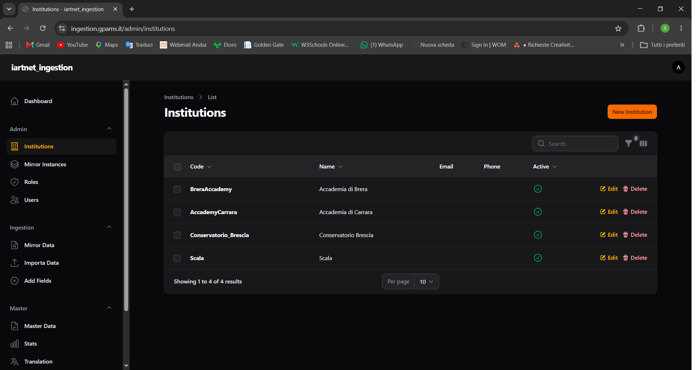
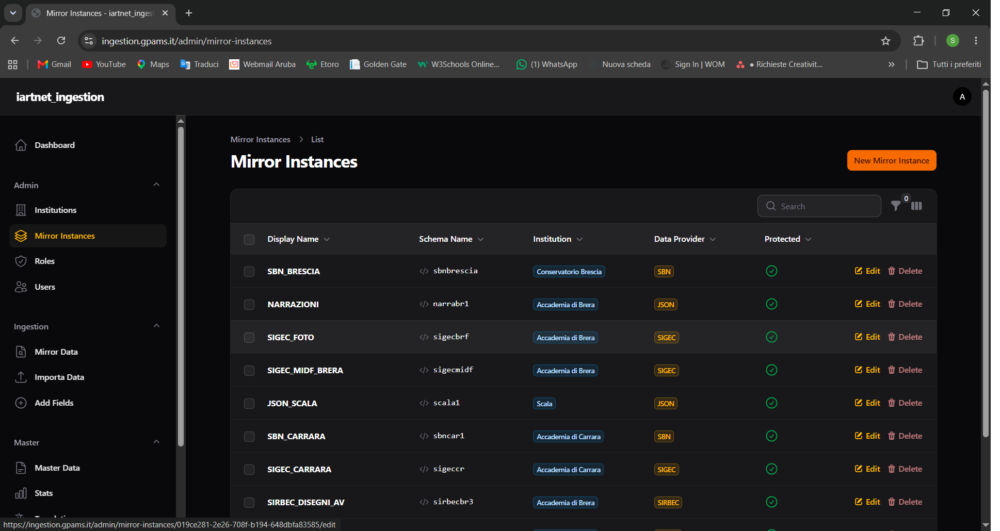

# Capitolo 1 — Preparazione istanza Mirror

## Obiettivo

Configurare l'ente (Institution) e l'istanza Mirror su cui verranno importati e revisionati i dati prima della promozione su Master.

## Quando usarlo

- Prima importazione dati per un nuovo ente.
- Creazione di un nuovo schema Mirror (es. ambiente di test separato).
- Cambio del data provider per una nuova istanza.

## Prerequisiti

- Utente con ruolo **admin** (le risorse **Admin** non sono accessibili a operatore/partner).
- Codice istituzione univoco e nome schema Mirror conforme alle regole di validazione.

---

## 1.1 Creare o verificare un'Institution

**Menu:** `Admin` → **Institutions**

*Figura 1.1 — Admin → Institutions: elenco istituzioni.*

### Campi del form

| Campo | Obbligatorio | Note |
|-------|--------------|------|
| **Name** | Sì | Nome leggibile dell'ente |
| **Code** | Sì | Codice identificativo univoco |
| **Description** | No | Descrizione libera |
| **Address**, **Email**, **Phone**, **Website** | No | Dati di contatto |
| **Data Provider** | No | `SIRBEC`, `SIGEC`, `SBN`, `JSON` |
| **Active** | No | Default: attivo |

### Azioni tabella

- **Edit** — modifica i dati dell'istituzione.
- **Delete** — elimina l'istituzione (con conferma).

### Risultato atteso

L'istituzione compare nell'elenco e sarà selezionabile in tutti i wizard di **Ingestion** (combo **Institution**).

---

## 1.2 Creare una Mirror Instance

**Menu:** `Admin` → **Mirror Instances** → **Create**

*Figura 1.2 — Form di creazione Mirror Instance (Schema Name, Display Name, Data Provider).*

### Campi del form

| Campo | Obbligatorio | Note |
|-------|--------------|------|
| **Schema Name** | Sì | Nome tecnico schema PostgreSQL. Solo minuscole, numeri e `_`; deve iniziare con lettera. **Non modificabile** dopo la creazione. |
| **Display Name** | Sì | Nome mostrato nell'interfaccia |
| **Description** | No | Descrizione libera |
| **Institution** | Sì | Istituzione titolare |
| **Data Provider** | No | `SIRBEC`, `SIGEC`, `SBN`, `JSON` — determina il mapping usato in promozione su Master |
| **Protected** | No | Se attivo, l'istanza **non può essere eliminata** |

#### Messaggio di validazione Schema Name

> *Schema name must start with a letter and contain only lowercase letters, numbers, and underscores.*

#### Helper text

- **Schema Name:** *Technical name of the PostgreSQL schema (lowercase, alphanumeric, underscores only)*
- **Display Name:** *Human-readable name for the UI*
- **Data Provider:** *Standard/source of the data stored in this mirror instance*
- **Protected:** *Protected instances cannot be deleted*

### Elenco Mirror Instances — colonne

| Colonna | Descrizione |
|---------|-------------|
| **Display Name** | Nome visualizzato |
| **Schema Name** | Nome schema (copiabile) |
| **Institution** | Istituzione collegata |
| **Data Provider** | Standard dati |
| **Protected** | Indicatore protezione |

### Filtri disponibili

- **Institution**
- **Protected** — All / Protected only / Not protected

### Eliminazione

**Delete** apre la modale:

- **Heading:** `Delete Mirror Instance`
- **Descrizione:** conferma eliminazione di display name e schema PostgreSQL associato. Azione irreversibile.
- **Pulsante conferma:** `Delete`
- Disabilitato se **Protected** = true.

**Bulk delete:** modale `Delete Mirror Instances` — elimina anche gli schema PostgreSQL associati.

### Risultato atteso

La Mirror Instance è disponibile nei wizard con etichetta `Display Name (schema_name)` nella combo **Mirror Schema**.

---

## 1.3 Permessi utente e scope istituzione

| Ruolo | Institutions / Mirror Instances | Wizard Ingestion |
|-------|--------------------------------|------------------|
| **admin** | CRUD completo | Tutte le istituzioni |
| **operatore** | Solo lettura (no accesso Admin) | Tutte le istituzioni |
| **partner** | Solo lettura (no accesso Admin) | Solo la propria istituzione (pre-selezionata) |

Se un partner tenta di accedere a un'istituzione diversa dalla propria, il sistema può restituire:

> *Accesso negato a questa istituzione*

---

## 1.4 Scelta del Data Provider

Il **Data Provider** sulla Mirror Instance guida la promozione su Master:

| Data Provider | Import pacchetto (Importa Data) | Mapping promozione Master |
|---------------|--------------------------------|---------------------------|
| **SIRBEC** / **SIGEC** | Pacchetto ICCD (ZIP) | `iccd-to-master.yaml` |
| **SBN** | Pacchetto SBN (ZIP) | `sbn-to-master.yaml` (normativa `MARC21`) |
| **JSON** | Pacchetto JSON (ZIP) | `json-to-master.yaml` (normativa `JSON`) |

Impostare il data provider coerente con il tipo di pacchetto che verrà caricato.

---

## Checklist

- [ ] Institution creata con **Code** univoco e **Active** = true
- [ ] Mirror Instance creata con **Schema Name** valido e **Data Provider** corretto
- [ ] Istanza visibile in **Mirror Schema** nei wizard **Importa Data** e **Mirror Data**
- [ ] Utenti operatori/partner hanno accesso all'istituzione corretta

## Prossimo passo

→ [Capitolo 2 — Import su Mirror](02-import-mirror.md)
