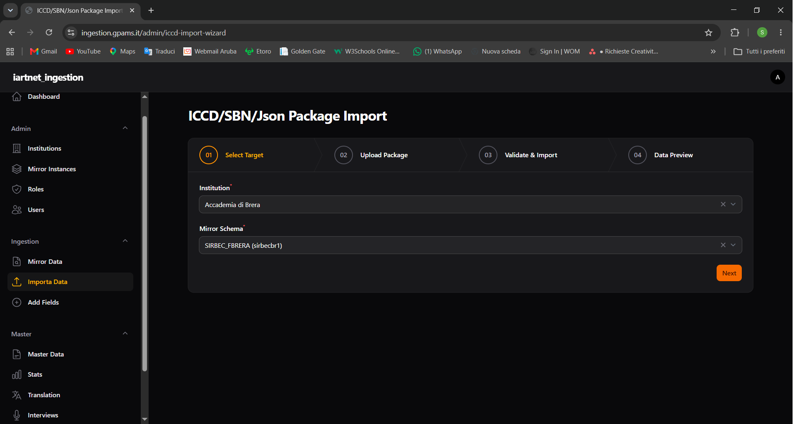
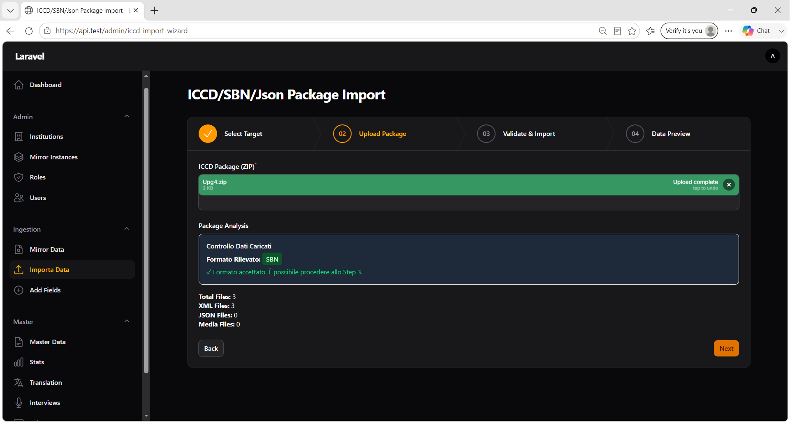
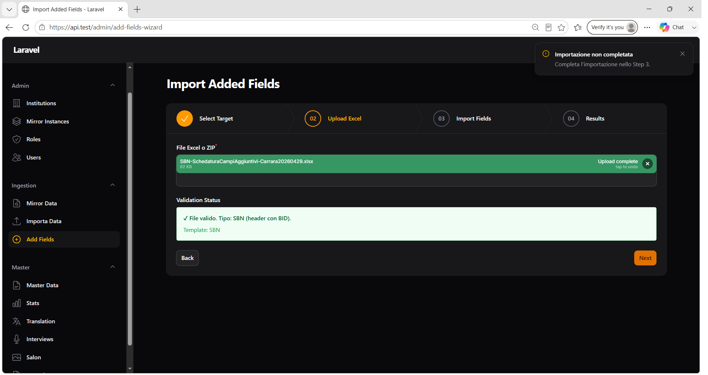
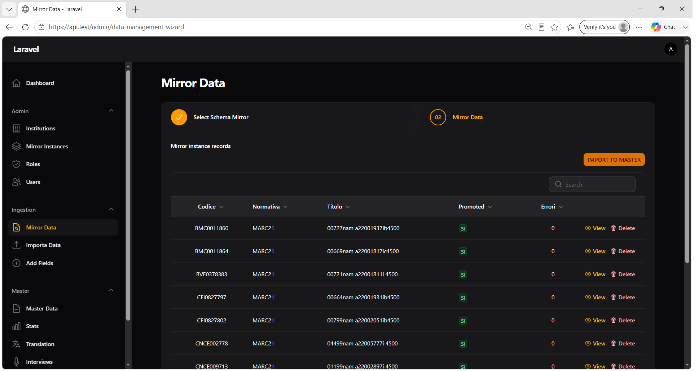
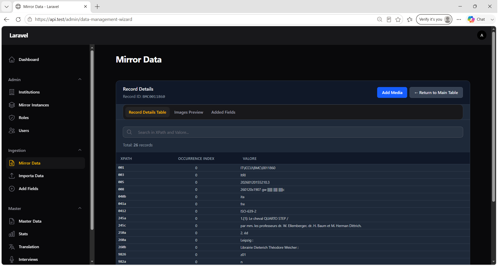

# Capitolo 2 — Importazione dati su Mirror

## Obiettivo

Caricare pacchetti dati (ZIP) o file Excel nello schema Mirror selezionato, per revisione prima della promozione su Master.

## Percorsi disponibili

| Menu | Titolo pagina | Uso |
|------|---------------|-----|
| **Ingestion → Importa Data** | ICCD/SBN/Json Package Import | Pacchetti ZIP (ICCD, SBN, JSON) |
| **Ingestion → Add Fields** | Import Added Fields | Campi aggiuntivi da Excel o ZIP con Excel/immagini |

---

## 2.1 Import pacchetto ZIP (ICCD / SBN / JSON)

**Menu:** `Ingestion` → **Importa Data**

### Step 1 — Select Target

| Campo | Obbligatorio | Descrizione |
|-------|--------------|-------------|
| **Institution** | Sì | Istituzione titolare (pre-compilata per utenti partner) |
| **Mirror Schema** | Sì | Istanza Mirror: `Display Name (schema_name)` |

Se si cambia **Institution**, la combo **Mirror Schema** viene azzerata.

*Figura 2.1 — Wizard Importa Data, Step 1: selezione Institution e Mirror Schema.*

### Step 2 — Upload Package

| Elemento | Valore |
|----------|--------|
| Etichetta upload | **ICCD Package (ZIP)** |
| Tipi accettati | `application/zip`, `application/x-zip-compressed` |
| Dimensione massima | **1 GB** (1 048 576 KB) |

Dopo il caricamento, il sistema analizza il pacchetto e mostra il riquadro **Package Analysis** / **Controllo Dati Caricati**:

| Informazione | Descrizione |
|--------------|-------------|
| **Formato Rilevato** | `ICCD`, `SBN`, `JSON` oppure `Formato non accettato` |
| **Total Files** | File totali nel pacchetto |
| **XML Files** | File XML (ICCD/SBN) |
| **JSON Files** | File JSON |
| **Media Files** | File multimediali |

*Figura 2.2 — Step 2: upload ZIP e riquadro analisi pacchetto.*

#### Notifiche Step 2

| Titolo | Tipo | Quando |
|--------|------|--------|
| **Package extracted successfully** | Success | Estrazione OK — *Package analyzed and ready. Click Next to proceed to validation.* |
| **Upload failed** | Danger | File ZIP non trovato |
| **Mirror schema required** | Danger | *Please select a mirror schema first* |
| **Upload processing failed** | Danger | Errore generico con messaggio dettaglio |

> **Nota:** se non si procede entro circa 1 minuto dopo l'upload, le cartelle temporanee di extraction possono essere eliminate automaticamente.

### Step 3 — Validate & Import

Comportamento in base al formato rilevato:

#### Formato ICCD

- La validazione XSD **non è esposta** nell'interfaccia (import diretto).
- Box **Informazioni Formato** con badge `ICCD`.

#### Formato SBN o JSON

- Box **Informazioni Formato** con messaggio:
  > *Per questo formato è disponibile solo l'importazione dati. La validazione XSD non è disponibile.*

#### Formato non accettato

- Notifica persistente:
  - **Titolo:** `Formato non accettato`
  - **Body:** *Il formato del pacchetto caricato non è supportato. Non è possibile procedere allo Step 3.*
- Messaggio nel riquadro: *⚠️ Non sarà possibile procedere allo Step 3 con questo formato.*

#### Pulsante import

| Pulsante | Azione |
|----------|--------|
| **Importa i Dati** | Avvia l'importazione nel Mirror |

*Figura 2.3 — Step 3: pulsante Importa i Dati e box Risultato importazione.*

#### Box risultato importazione (Step 3)

Dopo l'import, compare il riquadro **Risultato importazione**:

- **Record inseriti**
- **Record saltati**
- **Errori**

#### Notifiche import

| Titolo | Body (esempio) |
|--------|----------------|
| **Import completed** | `Imported: N, Updated: M, Errors: E` |
| **Import failed** | Messaggio errore |
| **Unsupported format** | `Format '…' is not supported for import.` |
| **No package loaded** | — |

Al termine dell'import, i record nel Mirror hanno **Promoted** = `No` (pronti per revisione e promozione).

### Step 4 — Data Preview

- Etichetta step: **Data Preview**
- Anteprima dati importati per il run corrente (record selezionabili).

### Re-import

Un nuovo import sullo stesso record imposta di nuovo **promoted = false** sul Mirror, consentendo la re-sincronizzazione verso Master.

---

## 2.2 Import campi aggiuntivi (Excel / ZIP)

**Menu:** `Ingestion` → **Add Fields**

### Step 1 — Select Target

Stessi campi di **Importa Data**:

- **Institution** (obbligatorio)
- **Mirror Schema** (obbligatorio)

### Step 2 — Upload Excel

| Elemento | Valore |
|----------|--------|
| Etichetta upload | **File Excel o ZIP** |
| Tipi accettati | `.xlsx`, `.xls`, `.zip` |
| Dimensione massima | **100 MB** |

*Figura 2.4 — Wizard Add Fields: upload file e stato validazione.*

#### Stati validazione (riquadro Validation Status)

| Stato | Messaggio UI |
|-------|--------------|
| In attesa | *Carica un file Excel per iniziare la validazione.* |
| In corso | *Validazione in corso...* |
| Valido | ✓ messaggio + **Template:** nome template |
| Non valido | ✗ messaggio errore |

#### Notifiche ZIP

| Titolo | Tipo |
|--------|------|
| **File ZIP valido** | Success |
| **ZIP elaborato** | Warning (con avvisi) |
| **ZIP non valido** | Warning / Danger |

### Step 3 — Import Fields

Prima dell'import, il riquadro mostra:

- **Pronto per l'importazione**
- **Template:** nome template riconosciuto
- **Schema:** nome schema Mirror

| Pulsante | Azione |
|----------|--------|
| **Importa Dati** | Esegue l'import dei campi aggiuntivi |

#### Notifiche import

| Titolo | Body |
|--------|------|
| **Importazione completata** | `Importati: N, Saltati: M` |
| **Errore** | *Dati mancanti per l'importazione: …* |
| **Errore** | *Il file Excel non è valido* |
| **Errore** | *Template non identificato* |
| **File non validato** | *Carica e valida un file Excel nello Step 2.* |
| **File non valido** | *Il file Excel deve essere valido per procedere all'importazione.* |

#### Box Import Results (Step 3)

Mostra conteggi **imported**, **skipped** ed eventuali **errors**.

### Step 4 — Results

- Etichetta: **Imported Records**
- Tabella record importati, oppure *Nessun record importato.*
- Se l'import non è completato: notifica **Importazione non completata** — *Completa l'importazione nello Step 3.*

I campi aggiuntivi restano con **promoted = false** fino alla sincronizzazione su Master (capitolo 3).

---

## 2.3 Revisione dati su Mirror Data

**Menu:** `Ingestion` → **Mirror Data**

### Step 1 — Select Schema Mirror

- **Institution**
- **Mirror Schema**

### Step 2 — Mirror Data

Tabella principale con colonne:

| Colonna | Descrizione |
|---------|-------------|
| **Codice** | `record_id` |
| **Normativa** | Codice e versione normativa |
| **Titolo** | Titolo record |
| **Promoted** | `Sì` / `No` — stato promozione su Master |
| **Errori** | Conteggio errori |

#### Azioni riga

| Azione | Descrizione |
|--------|-------------|
| **View** | Apre il dettaglio record |
| **Delete** | Elimina il record dal Mirror |

Notifiche eliminazione:

- **Record eliminato** (success)
- **Errore nell'eliminazione** (danger)

#### Pulsante promozione

In alto a destra nella tabella principale:

| Pulsante | Azione |
|----------|--------|
| **IMPORT TO MASTER** | Apre la sezione promozione (capitolo 3) |

*Figura 2.5 — Tabella record Mirror con colonna Promoted e pulsante IMPORT TO MASTER.*

### Dettaglio record (View)

**Header:** `Record Details` — Record ID: `{record_id}`

| Pulsante | Azione |
|----------|--------|
| **Add Media** | Carica immagine (jpg, png, tiff, gif, webp, bmp) |
| **← Return to Main Table** | Torna alla tabella principale |

**Tab:**

| Tab | Contenuto |
|-----|-----------|
| **Record Details Table** | Coppie XPath / Valore (colonne: **XPath**, **Occurrence Index**, **Valore**) |
| **Images Preview** | Anteprima asset immagine |
| **Added Fields** | Campi aggiuntivi importati via Excel |

*Figura 2.6 — Dettaglio record con tab Details, Images Preview e Added Fields.*

#### Modale Add Media

- **Titolo:** `Add Media`
- **Testo:** *Seleziona un file immagine (jpg, png, tiff, gif, webp, bmp).*
- **Cancel** / **Confirm**
- Durante upload: *Caricamento file...* / *Attendere upload...*

---

## Checklist post-import Mirror

- [ ] Notifica **Import completed** o **Importazione completata** ricevuta
- [ ] Record visibili in **Mirror Data** con **Promoted** = `No`
- [ ] Eventuali **Errori** > 0 analizzati nel dettaglio record
- [ ] Per campi aggiuntivi: tab **Added Fields** popolata nel dettaglio record

## Prossimo passo

→ [Capitolo 3 — Promozione su Master](03-promozione-master.md)
