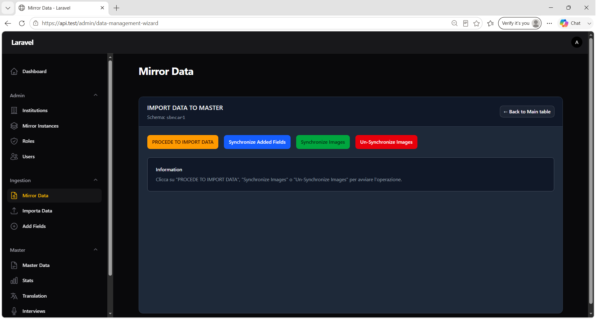
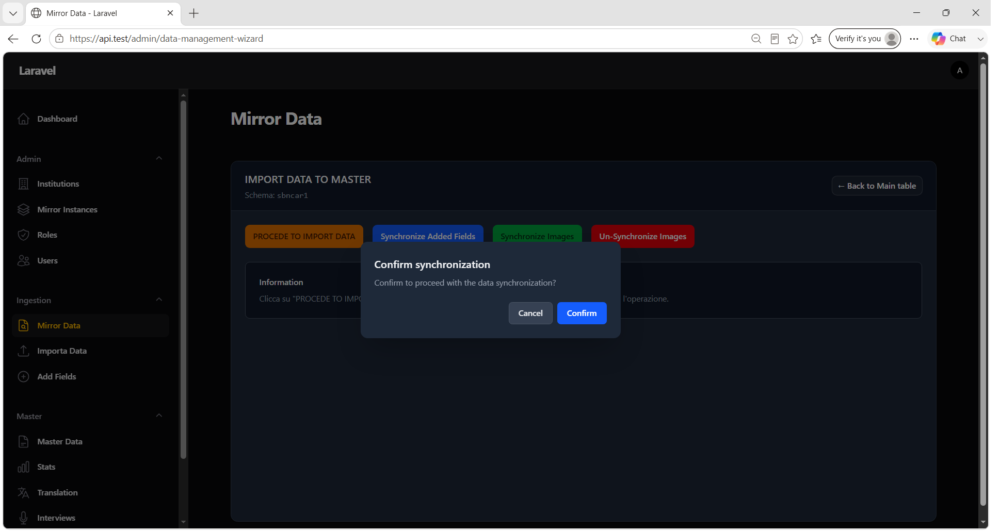
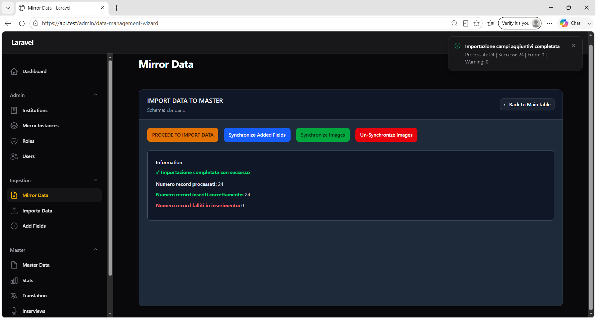
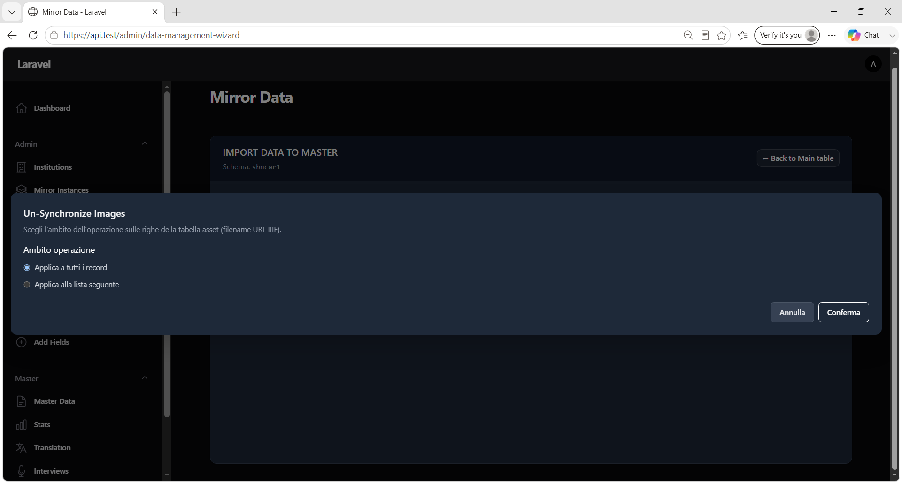

# Capitolo 3 — Promozione dati su Master

## Obiettivo

Sincronizzare i record dallo schema Mirror allo schema Master (`iartnet_master`): metadati, campi aggiuntivi e immagini. Ogni operazione è distinta e aggiorna il flag **Promoted** sul Mirror.

## Quando usarlo

- Dopo aver importato e revisionato i dati su Mirror (capitolo 2).
- Quando si aggiungono campi via **Add Fields** e si vogliono portare su Master.
- Quando si devono pubblicare le immagini su infrastruttura IIIF.

## Prerequisiti

- Record presenti su Mirror con **Promoted** = `No` (per le operazioni di sync).
- **Data Provider** della Mirror Instance allineato al tipo di dati (SIRBEC/SIGEC → ICCD, SBN, JSON).
- Per **Synchronize Images**: `IMAGES_ROOT` configurato e scrivibile; record già presenti su Master.

---

## 3.1 Accedere alla sezione promozione

**Menu:** `Ingestion` → **Mirror Data**

1. Step 1: selezionare **Institution** e **Mirror Schema**.
2. Step 2: nella tabella principale, cliccare **IMPORT TO MASTER**.

Si apre la sezione **IMPORT DATA TO MASTER** con intestazione:

- **Titolo:** `IMPORT DATA TO MASTER`
- **Sottotitolo:** `Schema: {nome_schema}`
- **Pulsante ritorno:** `← Back to Main table`



*Figura 3.1 — Sezione promozione con i quattro pulsanti di sincronizzazione.*

---

## 3.2 Le tre operazioni di sincronizzazione

Ogni operazione richiede conferma tramite modale.

### Modale conferma (comune)

| Elemento | Testo |
|----------|-------|
| **Titolo** | `Confirm synchronization` |
| **Messaggio** | *Confirm to proceed with the data synchronization?* |
| **Cancel** | Annulla |
| **Confirm** | Procede |



*Figura 3.2 — Modale di conferma prima di ogni operazione di sync.*

### Operazione 1 — Metadati scheda

| Pulsante | `PROCEDE TO IMPORT DATA` |
|----------|--------------------------|
| Cosa sincronizza | Record Mirror con **promoted = false** → tabelle Master (Dublin Core + EDM) |
| Mapping | Dipende dal **Data Provider** della Mirror Instance |

| Data Provider | Job / mapping | Filtro normativa |
|---------------|---------------|------------------|
| SIRBEC / SIGEC | Background job, `iccd-to-master.yaml` | Tutti i non promossi |
| SBN | Background job, `sbn-to-master.yaml` | Solo `normativa_code = MARC21` |
| JSON | Background job, `json-to-master.yaml` | Solo `normativa_code = JSON` |

#### Notifiche — avvio in background (ICCD / SBN / JSON)

| Titolo | Body |
|--------|------|
| **Importazione avviata** | *L'importazione ICCD → Master è stata accodata…* (o SBN/JSON) |
| | *…verrà eseguita dal worker. Controlla i log per l'esito.* |

#### Box Information — job in background

> *Cards import to Master procedure started, will be executed in background*

In questo caso i contatori nel box restano a zero finché il worker non completa l'elaborazione.

#### Errori comuni

| Titolo | Body |
|--------|------|
| **Errore** | *Schema Mirror o Institution non selezionati* |
| **Errore durante l'avvio dell'importazione** | Messaggio eccezione |

Dopo successo: i record Mirror interessati passano a **Promoted** = `Sì`.

---

### Operazione 2 — Campi aggiuntivi

| Pulsante | `Synchronize Added Fields` |
|----------|----------------------------|
| Cosa sincronizza | Righe `added_kv` con **promoted = false** verso Master |
| Mapping | `added-fields-to-master.yaml` |
| Esecuzione | **Sincrona** (risultato immediato nel box Information) |

#### Notifiche

| Titolo | Body |
|--------|------|
| **Importazione campi aggiuntivi completata** | `Processati: N \| Successi: N \| Errori: N \| Warning: N` |
| **Errore durante l'importazione campi aggiuntivi** | Messaggio errore |

#### Box Information — successo

- **✓ Importazione completata con successo**
- **Numero record processati**
- **Numero record inseriti correttamente**
- **Numero record falliti in inserimento**
- **Warning** (se presenti)



*Figura 3.3 — Riquadro Information con riepilogo numerico (o messaggio job in background).*

---

### Operazione 3 — Immagini

| Pulsante | `Synchronize Images` |
|----------|----------------------|
| Cosa sincronizza | Asset Mirror con **promoted = false** e **exists_flag = true** |
| Destinazione | Copia in `IMAGES_ROOT`, registrazione URL IIIF in `web_resources` |
| Prerequisito | Record Master esistente con `stable_id` = `record_id` Mirror |

#### Notifiche

| Titolo | Body |
|--------|------|
| **Sincronizzazione immagini completata** | Riepilogo processati / successi / errori / saltati |
| **Errore durante la sincronizzazione immagini** | Messaggio errore (es. `IMAGES_ROOT non configurato o directory non scrivibile`) |

#### Box Information — dettaglio errori immagini

Se presenti errori, compare la sezione **Dettagli Errori (N)** con per ogni voce:

- **Filename**
- **record_id**
- Messaggio errore (es. *Record Master non trovato*, *Immagine non trovata*, *import_run_id non trovato*)

Dopo successo: asset Mirror aggiornati con **promoted = true** e **filename** = URL IIIF.

---

## 3.3 Un-Synchronize Images (operazione inversa)

| Pulsante | `Un-Synchronize Images` |
|----------|-------------------------|
| Effetto | Rimuove file da `IMAGES_ROOT` e righe `web_resources` in base agli URL IIIF negli asset Mirror |

### Modale ambito

| Elemento | Testo |
|----------|-------|
| **Titolo** | `Un-Synchronize Images` |
| **Descrizione** | *Scegli l'ambito dell'operazione sulle righe della tabella asset (filename URL IIIF).* |

#### Opzioni ambito

| Opzione | Descrizione |
|---------|-------------|
| **Applica a tutti i record** | Tutti gli asset con URL IIIF |
| **Applica alla lista seguente** | Solo `record_id` indicati (separati da virgola) |



*Figura 3.4 — Modale per scegliere l'ambito dell'un-synchronize immagini.*

Campo lista (se ambito lista): placeholder `es. REC001, REC002, REC003`

| Pulsante | Azione |
|----------|--------|
| **Annulla** | Chiude modale |
| **Conferma** | Esegue un-synchronize |

#### Validazione lista

Se la lista è vuota:

- **Titolo:** `Errore`
- **Body:** *Specificare almeno un record_id nella lista (valori separati da virgola).*

#### Notifiche esito

| Titolo | Body |
|--------|------|
| **Un-synchronize immagini completato** | `Processate: N \| Completate: N \| Errori: N \| Saltate (non IIIF): N` |
| **Errore durante un-synchronize immagini** | Messaggio errore |

---

## 3.4 Ordine consigliato delle operazioni

```text
1. PROCEDE TO IMPORT DATA     → crea/aggiorna schede Master (metadati)
2. Synchronize Added Fields   → integra campi aggiuntivi (se presenti)
3. Synchronize Images         → pubblica immagini su IIIF
```

> **Importante:** la sincronizzazione immagini richiede che il record esista già su Master (passo 1 completato per quel `record_id`).

---

## 3.5 Verifica post-promozione

### Su Mirror Data

- Colonna **Promoted** = `Sì` per i record sincronizzati.
- Tab **Images Preview**: immagini con URL IIIF dopo sync immagini.

### Su Master Data

- Scheda visibile dopo **SEARCH** (capitolo 4) con **Stable ID** corrispondente.
- Tab **Images Preview** nel dettaglio scheda popolata.

### Log applicativi

Per import metadati in background (ICCD/SBN/JSON), verificare i log del worker Laravel/queue per l'esito completo.

---

## Checklist

- [ ] **PROCEDE TO IMPORT DATA** eseguito (o job in background avviato)
- [ ] **Synchronize Added Fields** eseguito se si usano Excel Add Fields
- [ ] **Synchronize Images** eseguito se il pacchetto contiene media
- [ ] **Promoted** = `Sì` sui record Mirror interessati
- [ ] Schede presenti in **Master → Master Data**

## Prossimo passo

→ [Capitolo 4 — Gestione dati su Master](04-gestione-master.md)
