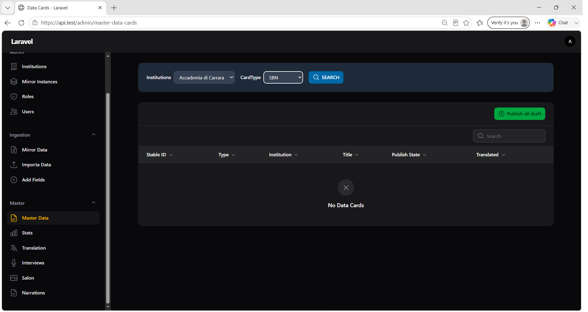
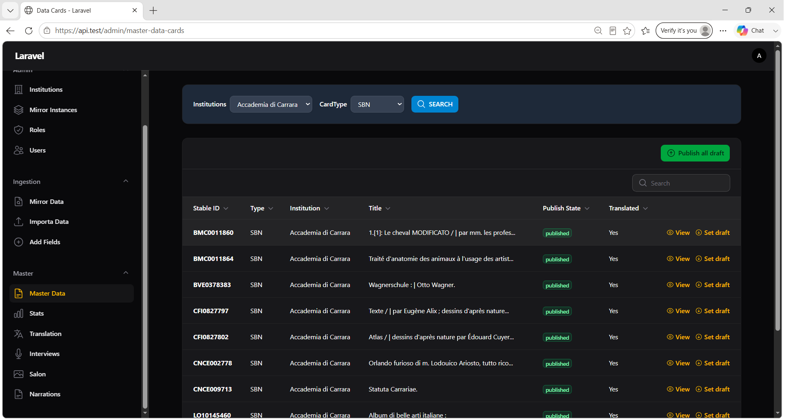
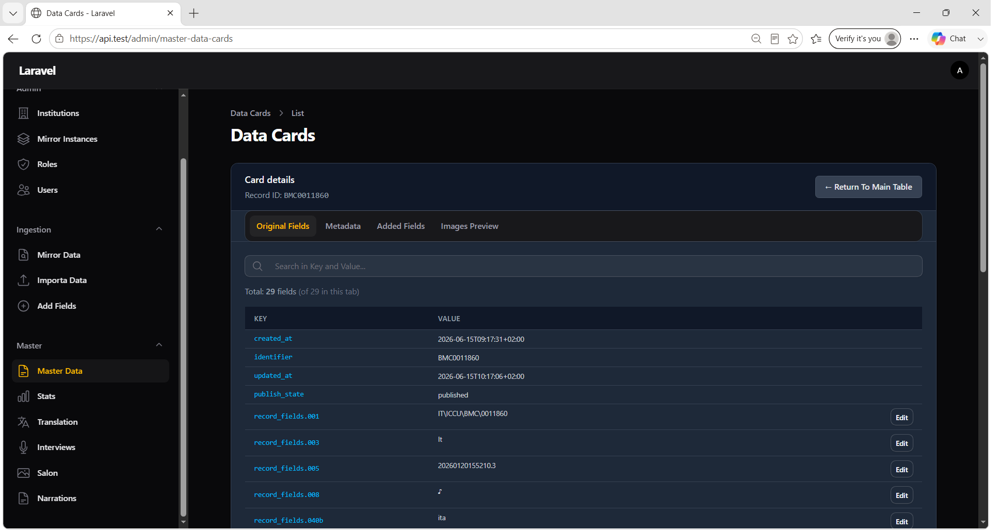

# Capitolo 4 — Gestione dati su istanza Master

## Obiettivo

Consultare, filtrare, modificare e pubblicare le schede presenti nel database Master dopo la promozione da Mirror.

## Quando usarlo

- Verifica che la promozione sia andata a buon fine.
- Consultazione e modifica campi su scheda Master.
- Gestione stato di pubblicazione (`draft` / `published`).
- Riordino e pubblicazione immagini IIIF associate alla scheda.

## Prerequisiti

- Record promossi su Master (capitolo 3).
- Accesso al menu **Master → Master Data** (admin, operatore o partner con istituzione associata).

---

## 4.1 Elenco schede Master Data

**Menu:** `Master` → **Master Data**

Le schede provengono dalla vista `iartnet_master.v_dc_rec_table`. **Non è possibile** creare, modificare o eliminare schede dall'elenco (solo consultazione e azioni specifiche).

### Filtri header

Prima di visualizzare dati, configurare i filtri e premere **SEARCH**. Fino a quel momento la tabella resta **vuota**.

| Controllo | Descrizione |
|-----------|-------------|
| **Institutions** | Istituzione da consultare (pre-selezionata per utenti partner) |
| **CardType** | Tipo scheda |

#### Valori CardType

| Valore | Etichetta |
|--------|-----------|
| TUTTE | ALL |
| OA | OA |
| D | D |
| F | F |
| S | S |
| MI | MI |
| MIDF | MIDF |
| MINV | MINV |
| SBN | SBN |
| JSON | JSON |
| INTERVISTA | INTERVIEW |
| SALON | SALON_N |

| Pulsante | Azione |
|----------|--------|
| **SEARCH** | Carica la tabella in base a Institution + CardType |

*Figura 4.1 — Barra filtri Institutions, CardType e pulsante SEARCH.*

### Colonne tabella

| Colonna | Descrizione |
|---------|-------------|
| **Stable ID** | Identificativo stabile (ricercabile) |
| **Type** | Tipo scheda |
| **Institution** | Istituzione |
| **Title** | Titolo (ricerca anche su subject/subjectb) |
| **Publish State** | `draft` (badge giallo) o `published` (badge verde) |
| **Translated** | Yes / No |

### Azioni riga

| Azione | Descrizione |
|--------|-------------|
| **View** | Apre il dettaglio scheda nella stessa pagina |
| **Publish** / **Set draft** | Alterna lo stato di pubblicazione della singola scheda |

#### Notifica cambio stato singola scheda

| Titolo | Body |
|--------|------|
| **State updated** | `Publish state set to "draft".` oppure `"published".` |

### Azione bulk — Publish all draft

| Pulsante | `Publish all draft` |
|----------|---------------------|
| Modale heading | `Publish all draft cards` |
| Modale descrizione | *Publish all the cards type {CardType} of the Institution {nome}?* |

Pubblica in blocco tutte le schede in stato `draft` per i filtri correnti (Institution + CardType).

*Figura 4.2 — Elenco schede con Stable ID, Publish State e azioni View / Publish.*

---

## 4.2 Dettaglio scheda (Card details)

Aprire con **View** su una riga, oppure cliccando sulla riga (stessa azione).

### Header

| Elemento | Testo |
|----------|-------|
| **Titolo** | `Card details` |
| **Sottotitolo** | `Record ID: {stable_id}` |
| **Pulsante** | `← Return To Main Table` |

### Tab dati

| Tab | Contenuto |
|-----|-----------|
| **Original Fields** | Campi originali dalla normativa sorgente |
| **Metadata** | Metadati di sistema / descrittivi |
| **Added Fields** | Campi aggiuntivi importati via Excel |
| **Images Preview** | Anteprima e gestione immagini IIIF |

*Figura 4.3 — Dettaglio scheda con tab campi e anteprima immagini.*

### Ricerca nei campi

Campo di ricerca: placeholder **Search in Key and Value...**

Contatore: `Total: N fields (of M in this tab)` — con indicatore `(filtered)` se attivo un filtro.

Se nessun dato: *No record data found*

### Modifica inline valori

Alcune righe sono editabili (in base al tab e alla chiave campo):

| Tab | Campi editabili |
|-----|-----------------|
| **Original Fields** | Righe con chiave `record_fields.*` |
| **Metadata** | Righe con chiave `record_fields.*` |
| **Added Fields** | Tutte le righe del tab |

Flusso modifica (per righe editabili):

1. Attivare modifica sulla riga.
2. Modificare il valore.
3. Salvare o annullare.

Le modifiche vengono persistite in `i18n_texts` sul Master.

---

## 4.3 Tab Images Preview

Gestione immagini associate alla scheda (da `web_resources` / IIIF).

Funzionalità tipiche (controlli nel pannello immagini):

- Selezione immagine dall'elenco
- **Toggle publish state** dell'immagine selezionata
- **Spostamento ordine** immagini (su/giù) quando applicabile

Notifiche correlate allo stato immagine seguono lo stesso pattern di **State updated** per le schede.

---

## 4.4 Pagina View dedicata

Esiste anche una route di dettaglio standalone:

**Master Data** → View su scheda → URL `/admin/master-data-cards/view/{stable_id}`

Comportamento e tab analoghi a **Card details** incorporato nella lista (`ViewMasterDataCard`).

---

## 4.5 Stati di pubblicazione — riepilogo

| Stato | Significato operativo |
|-------|----------------------|
| **draft** | Scheda presente su Master, non ancora pubblicata |
| **published** | Scheda pubblicata |

Transizioni:

- Singola scheda: azione **Publish** / **Set draft** nella tabella.
- Multipla: **Publish all draft** con conferma modale.

---

## 4.6 Relazione Mirror ↔ Master

| Concetto Mirror | Concetto Master |
|-----------------|-----------------|
| `record_id` | `stable_id` |
| **Promoted** = `Sì` | Scheda presente e sincronizzata |
| Asset con URL IIIF | `web_resources` + anteprima in Images Preview |

Per aggiornare dati già promossi:

1. Re-importare su Mirror (imposta **promoted = false**).
2. Ripetere le operazioni di sincronizzazione (capitolo 3).

---

## Checklist gestione Master

- [ ] **SEARCH** eseguito con Institution e CardType corretti
- [ ] Schede promosse visibili con **Stable ID** atteso
- [ ] **Publish State** coerente con il processo editoriale (`draft` / `published`)
- [ ] Campi e immagini verificati nei tab di dettaglio
- [ ] Eventuali correzioni inline salvate

## Prossimo passo

→ [Capitolo 5 — Translation worker](05-translation.md)

## Riferimenti

- [Capitolo 1 — Setup Mirror](01-setup-mirror.md)
- [Capitolo 2 — Import su Mirror](02-import-mirror.md)
- [Capitolo 3 — Promozione su Master](03-promozione-master.md)
- [Indice manuale](README.md)
