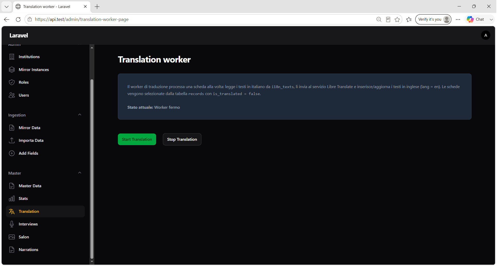

# Capitolo 5 — Translation worker

## Obiettivo

Avviare o fermare il worker che traduce automaticamente le schede Master dall'italiano all'inglese, popolando `i18n_texts` con `lang = en` e aggiornando il flag **Translated** sulla scheda.

## Quando usarlo

- Dopo la promozione su Master o la creazione diretta di schede (Interview, Salon, ecc.) con testi solo in italiano.
- Quando in **Master Data** la colonna **Translated** resta su `No` per una o più schede.
- Per processare in batch le schede con `is_translated = false` senza intervento manuale campo per campo.

## Prerequisiti

- Accesso al menu **Master → Translation** (admin, operatore o partner con sezioni operative).
- Servizio **Libre Translate** raggiungibile e variabile `LIBRE_TRANSLATE_URL` configurata sul server.
- **Queue worker** Laravel in esecuzione (`php artisan queue:work`), perché i job di traduzione vengono accodati.
- Scheduler Laravel attivo (`php artisan schedule:work` o cron), che invia i job ogni minuto quando il worker è abilitato.

---

## 5.1 Pagina Translation worker

**Menu:** `Master` → **Translation**

**Titolo pagina:** `Translation worker`

*Figura 5.1 — Pagina Translation worker con stato e pulsanti Start/Stop.*

### Descrizione operativa (testo in pagina)

Il worker processa **una scheda alla volta**:

1. Legge i testi in italiano da `i18n_texts` (`lang = it`) per la scheda e per le entità collegate (place, agent).
2. Invia i testi al servizio Libre Translate.
3. Inserisce o aggiorna le righe tradotte con `lang = en`.
4. Imposta `records.is_translated = true` sulla scheda elaborata.

Le schede candidate sono quelle con **`is_translated = false`** nella tabella `records`.

### Indicatore stato

| Stato UI | Significato |
|----------|-------------|
| **Worker attivo** | Il flag di sistema è abilitato; lo scheduler può inviare nuovi job |
| **Worker fermo** | Nessun nuovo job verrà accodato dallo scheduler |

---

## 5.2 Avviare e fermare il worker

| Pulsante | Azione |
|----------|--------|
| **Start Translation** | Abilita il worker (flag in cache) |
| **Stop Translation** | Disabilita il worker |

### Notifiche

| Titolo | Tipo | Body |
|--------|------|------|
| **Translation worker avviato** | Success | *Il worker è attivo. Lo scheduler invierà un job ogni minuto per tradurre le schede con is_translated = false.* |
| **Translation worker fermato** | Warning | *Il worker è stato disattivato. I job già in coda verranno ancora eseguiti.* |

> **Nota:** fermare il worker non annulla i job già accodati; attendere che la coda si svuoti o intervenire sul worker di coda se necessario.

---

## 5.3 Comportamento della traduzione

### Frequenza e throughput

Quando il worker è **attivo**, lo scheduler Laravel:

- viene eseguito **ogni minuto**;
- accoda fino a **50 job** `TranslateRecordJob` per ogni run;
- ogni job seleziona **al massimo una scheda** (`FOR UPDATE SKIP LOCKED`), evitando elaborazioni duplicate.

### Campi tradotti

Per ogni scheda selezionata vengono considerati i testi IT con `entity_type` in:

| entity_type | Ambito |
|-------------|--------|
| **record** | Campi della scheda |
| **place** | Luoghi collegati via `record_places` |
| **agent** | Agenti collegati via `record_agents` |

### Casi in cui il testo IT viene copiato in EN (senza chiamata a Libre Translate)

| Condizione | Esempio |
|------------|---------|
| Testo **tutto maiuscolo** | `MUSEO NAZIONALE` |
| `field_name = title` | Titolo scheda |
| Valore **puramente numerico** (dopo trim) | `42`, `3.14` |

### Esito sulla scheda

- Al termine con successo: `records.is_translated = true`.
- In **Master Data**, colonna **Translated** passa a **Yes**.
- Se la scheda non ha testi IT: viene comunque marcata come tradotta.

### Scheda già tradotta o modificata

Se una scheda viene aggiornata e richiede una nuova traduzione, il flag `is_translated` deve tornare a `false` (operazione di backend o re-import, a seconda del flusso). Il worker elabora solo schede con flag `false`.

> **Eccezione Salon:** le schede SALON create via import hanno `is_translated = true` già in fase di creazione (testi EN duplicati dai valori IT al momento dell'import).

---

## 5.4 Verifica e troubleshooting

### Checklist operativa

- [ ] **Start Translation** premuto e stato **Worker attivo** visibile
- [ ] Queue worker in esecuzione sul server
- [ ] Scheduler attivo (cron o `schedule:work`)
- [ ] Colonna **Translated** = **Yes** sulle schede attese in **Master Data**

### Sintomi comuni

| Sintomo | Azione |
|---------|--------|
| **Translated** resta `No` | Verificare che il worker sia attivo, la coda in esecuzione e `LIBRE_TRANSLATE_URL` configurata |
| Nessuna scheda elaborata | Controllare che esistano record con `is_translated = false` |
| Errori in log | Cercare `TranslateRecordJob` nei log applicativi (timeout Libre Translate, risposta API non valida) |
| Job in coda ma worker fermo | Attendere completamento job già accodati prima dello stop, oppure svuotare la coda |

### Log

Messaggi utili nei log:

- `TranslateRecordJob: Record translated` — scheda elaborata con successo
- `TranslateRecordJob: Worker disabled, skipping` — flag disattivato
- `TranslateRecordJob: LIBRE_TRANSLATE_URL not set` — configurazione mancante

---

## Prossimo passo

→ [Capitolo 6 — Interviews (import)](06-interviews.md)
