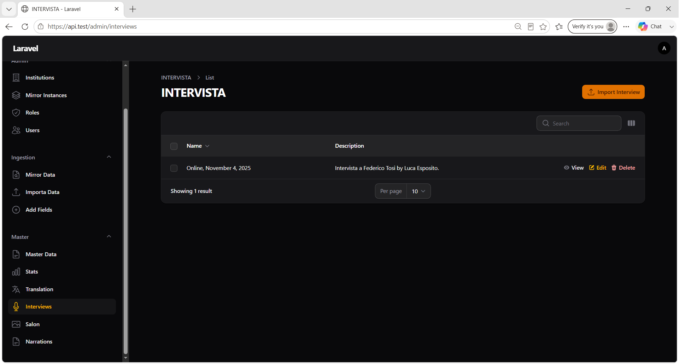
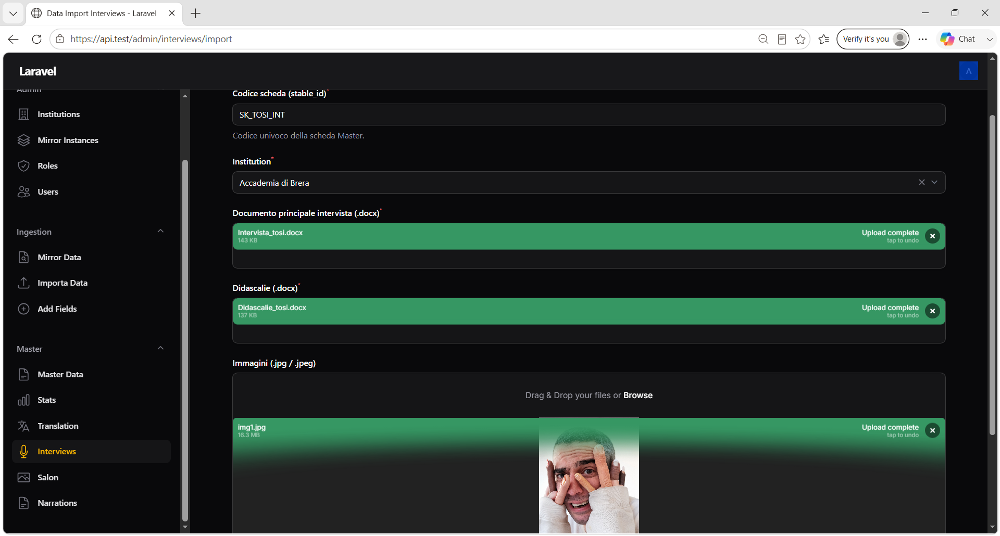

# Capitolo 6 — Interviews (INTERVISTA)

## Obiettivo

Importare interviste da documenti Word (.docx) e immagini JPEG, creando una scheda Master di tipo **INTERVISTA** e la relativa riga nella tabella `interviews`. Consultare, modificare ed eliminare le interviste già importate.

## Quando usarlo

- Ingestione di un'intervista strutturata (domande/risposte, bio, didascalie immagini) senza passare da Mirror.
- Revisione o correzione metadati e JSON di posizionamento immagini su un'intervista esistente.
- Rimozione completa di un'intervista e della scheda Master collegata.

## Prerequisiti

- Accesso a **Master → Interviews** (admin, operatore o partner con sezioni operative).
- Variabile **`INGEST_FS_ROOT`** configurata su directory esistente e scrivibile.
- Per import con immagini: **`IMAGES_ROOT`** scrivibile e **`IIIF_PUBLIC_BASE`** configurato.
- **Codice scheda (`stable_id`)** univoco, non già presente su Master.
- Documenti `.docx` conformi al formato descritto in § 6.3.

> **Nota:** le interviste **non** si creano con il pulsante Create standard: l'unico percorso di creazione è **Import Interview**.

---

## 6.1 Elenco Interviews

**Menu:** `Master` → **Interviews**

Etichetta risorsa in UI: **INTERVISTA** (singolare/plurale).



*Figura 6.1 — Tabella interviste con azioni View, Edit, Delete.*

### Colonne tabella

| Colonna | Descrizione |
|---------|-------------|
| **Name** | Nome intervista (derivato dall'header del documento o dallo `stable_id`) |
| **Description** | Descrizione (opzionale, spesso vuota dopo import) |
| **Created at** / **Updated at** | Timestamp (colonne nascoste di default) |

### Azioni

| Azione | Descrizione |
|--------|-------------|
| **Import Interview** | Apre il wizard di import (header, pulsante in alto a destra) |
| **View** | Dettaglio sola lettura |
| **Edit** | Modifica Name, Description, Ext JSON |
| **Delete** | Elimina intervista **e** scheda Master collegata (record, KV, i18n, immagini IIIF) |

**Bulk delete:** elimina in blocco le interviste selezionate con la stessa logica della delete singola.

---

## 6.2 Procedura di import — panoramica

L'import è un processo **in due step** sulla pagina **Data Import Interviews**:

```text
Step 1 — Upload (Step 1)
  Caricamento file + salvataggio sotto INGEST_FS_ROOT/interviews/{runId}
        ↓
Step 2 — Crea scheda Master (Step 2)
  Parsing DOCX, creazione record Master + Interview, copia immagini IIIF
        ↓
Redirect al dettaglio Interview (View)
```

**Percorso menu:** `Master` → **Interviews** → **Import Interview**



*Figura 6.2 — Form import con campi scheda, documenti DOCX, immagini e pulsanti Step 1 / Step 2.*

---

## 6.3 Preparazione dei file sorgente

### Documento principale (`main.docx`)

Il parser estrae **un paragrafo per riga**. Struttura attesa:

| Sezione | Formato nel DOCX |
|---------|------------------|
| **Header** | Primo paragrafo del documento (titolo/intestazione) |
| **Intervistatore** | Paragrafo che inizia con `Intervistatore` (eventuale testo sulla stessa riga o paragrafi successivi fino al prossimo marker) |
| **Intervistato** | Paragrafo che inizia con `Intervistato` |
| **Bio** | Paragrafi liberi, oppure blocco che inizia con `Bio:` |
| **Domanda** | Paragrafo contenente il marker **`(Q)`** (varianti ammesse: `( Q )`, spazi opzionali) |
| **Risposta** | Testo sulla stessa riga dopo `(A)` oppure paragrafi successivi fino alla prossima domanda o immagine |
| **Immagine** | Paragrafo dedicato: `Immagine: nomefile.jpg` (nome file **senza path**) |

> **Obbligatorio:** almeno **un blocco domanda/risposta** con marker `(Q)` / `(A)`. In assenza, Step 2 fallisce con errore esplicito.

#### Esempio struttura (semplificata)

```text
Titolo dell'intervista

Intervistatore
Mario Rossi

Intervistato
Luigi Bianchi

Bio: Breve biografia dell'intervistato...

(Q) Prima domanda?
(A) Prima risposta.

Immagine: foto_01.jpg

(Q) Seconda domanda?
(A) Seconda risposta.
```

### Documento didascalie (`didascalie.docx`)

- Un paragrafo per didascalia, **nell'ordine** in cui le immagini compaiono nel documento principale.
- La prima didascalia corrisponde al primo placeholder `Immagine: …`, la seconda al secondo, e così via.
- Paragrafi vuoti vengono ignorati.

### Immagini

| Requisito | Valore |
|-----------|--------|
| Formati accettati | `.jpg`, `.jpeg` |
| Upload | Multiplo, **ordinabile** (l'ordine di upload determina `img_001.jpg`, `img_002.jpg`, …) |
| Obbligatorietà | Opzionale (se assenti, l'intervista viene creata senza `web_resources`) |

> I nomi nei tag `Immagine: nomefile.jpg` servono al JSON di posizionamento (`interviews.ext_json`); i file effettivi caricati sono rinominati in sequenza durante Step 1.

---

## 6.4 Step 1 — Upload

### Campi form

| Campo | Obbligatorio | Descrizione |
|-------|--------------|-------------|
| **Codice scheda (stable_id)** | Sì | Codice univoco della scheda Master |
| **Institution** | Sì | Istituzione titolare (combo searchable) |
| **Documento principale intervista (.docx)** | Sì | File Word principale |
| **Didascalie (.docx)** | Sì | File Word delle didascalie |
| **Immagini (.jpg / .jpeg)** | No | Una o più immagini JPEG |

### Pulsante

| Pulsante | Azione |
|----------|--------|
| **Upload (Step 1)** | Valida i campi, copia i file su disco |

### Cosa succede sul server

I file vengono salvati sotto:

```text
INGEST_FS_ROOT/interviews/{runId}/
  main.docx
  didascalie.docx
  images/
    img_001.jpg
    img_002.jpg
    …
```

`{runId}` è un UUID generato al momento dell'upload.

### Indicatore Step 1

| Stato | Messaggio |
|-------|-----------|
| Prima dell'upload | *Caricare i file e premere «Upload (Step 1)» per salvare sotto INGEST_FS_ROOT.* |
| Dopo upload OK | *Upload completato. Cartella: interviews/{runId}* |

### Notifiche Step 1

| Titolo | Tipo | Quando |
|--------|------|--------|
| **INGEST_FS_ROOT non valido** | Danger | Directory ingestion assente o non scrivibile |
| **Step 1 completato** | Success | *File salvati in INGEST_FS_ROOT/interviews/{runId}. Procedere con Step 2.* |
| **Errore upload** | Danger | Copia file fallita o upload non leggibile |

---

## 6.5 Step 2 — Creazione scheda Master

Il pulsante **Crea scheda Master (Step 2)** compare solo dopo Step 1 completato con successo.

| Pulsante | Azione |
|----------|--------|
| **Crea scheda Master (Step 2)** | Parsing DOCX, insert su Master, redirect a View Interview |

### Operazioni eseguite

1. Verifica che `stable_id` **non esista** già su Master.
2. Estrae paragrafi da `main.docx` e `didascalie.docx`.
3. Crea record in `records` con:
   - `publish_state = draft`
   - `primary_lang = it`
   - `edm_type = TEXT`
4. Popola `record_kv` e `i18n_texts` (IT + copia EN iniziale) con campi:
   - `card_type = INTERVISTA`
   - `header`, `intervistatore`, `intervistato`, `bio`
   - `domanda_N`, `risposta_N` per ogni coppia Q/A
   - `didascalia_N` per ogni didascalia
   - `QuestionsNumber` (conteggio domande)
5. Copia immagini in `IMAGES_ROOT` e registra URL IIIF in `web_resources` (se presenti).
6. Crea riga in `interviews` con `ext_json` di posizionamento immagini.

### Notifiche Step 2

| Titolo | Tipo | Quando |
|--------|------|--------|
| **Step 1 mancante** | Danger | Step 2 invocato senza upload precedente |
| **Scheda creata** | Success | *Record Master e Interview creati.* → redirect a **View** |
| **Errore creazione scheda** | Danger | stable_id duplicato, DOCX non valido, IIIF/IMAGES_ROOT mancanti, ecc. |

### Errori frequenti Step 2

| Messaggio (esempio) | Causa |
|---------------------|-------|
| *Esiste già una scheda con codice (stable_id) '…'* | Codice già usato |
| *Il documento principale non contiene testo utilizzabile* | DOCX principale vuoto |
| *Nessun blocco domanda/risposta rilevato…* | Mancano marker `(Q)` / `(A)` |
| *File principale o didascalie mancanti…* | Cartella run incompleta |
| *IIIF_PUBLIC_BASE non configurato* | Import con immagini senza IIIF |
| *IMAGES_ROOT non configurato o non scrivibile* | Import con immagini senza storage |

---

## 6.6 Dettaglio e modifica (View / Edit)

Dopo l'import, o dalla lista **Interviews** → **View** o **Edit**.

### Campi editabili

| Campo | Note |
|-------|------|
| **Name** | Obbligatorio, max 255 caratteri |
| **Description** | Testo libero |
| **Ext JSON** | JSON formattato; helper: *JSON libero. Visualizzazione formattata: modifica direttamente il testo (sintassi JSON valida).* |

### Consultazione scheda Master collegata

Dalla scheda Master (capitolo 4), filtrare **CardType = INTERVISTA** e cercare lo **Stable ID** usato in import.

---

## 6.7 Eliminazione

**Delete** (singola o bulk) esegue una cancellazione **completa**:

- Riga `interviews`
- Record Master (`records`)
- `record_kv`, `i18n_texts`
- `web_resources` e file immagine in `IMAGES_ROOT` (se configurato)

> Operazione **irreversibile**. Verificare lo Stable ID prima di confermare.

---

## Checklist import Interview

- [ ] `stable_id` univoco scelto
- [ ] `main.docx` con header, almeno una coppia `(Q)`/`(A)`, marker immagine se necessario
- [ ] `didascalie.docx` con didascalie in ordine
- [ ] Immagini JPEG caricate (se previste) e `IMAGES_ROOT` / `IIIF_PUBLIC_BASE` OK
- [ ] **Upload (Step 1)** completato
- [ ] **Crea scheda Master (Step 2)** completato con redirect a View
- [ ] Scheda visibile in **Master Data** con CardType **INTERVISTA**
- [ ] (Opzionale) **Translation worker** avviato se servono traduzioni EN automatiche

## Prossimo passo

→ [Capitolo 7 — Salon (import)](07-salon.md)
