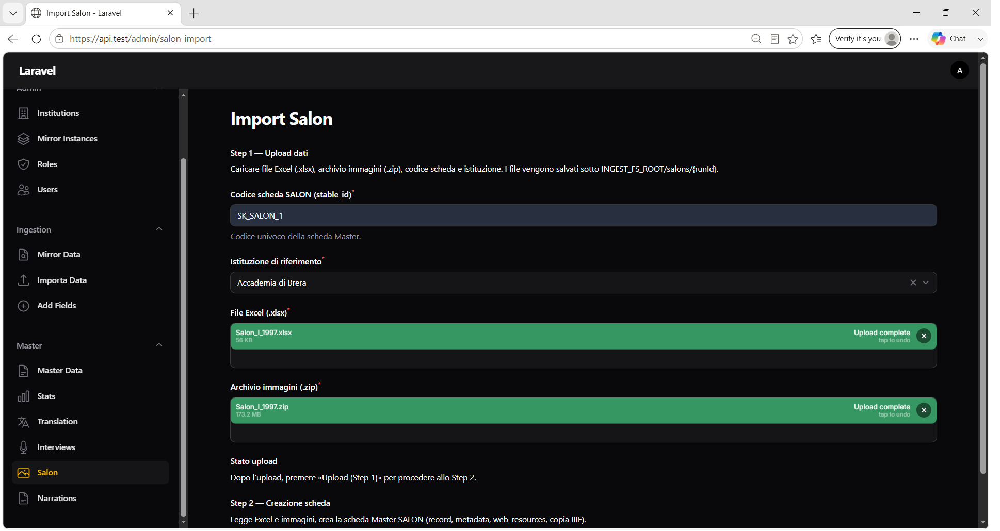

# Capitolo 7 — Salon (import SALON)

## Obiettivo

Importare una scheda **SALON** da file Excel (.xlsx) e archivio immagini (.zip), creando direttamente record Master con metadati, dati studenti per pagina e risorse IIIF.

## Quando usarlo

- Pubblicazione di un catalogo/salon con pagine espositiva e schede studenti per pagina.
- Ingestione batch di immagini pagina + metadati strutturati senza passare da Mirror.

## Prerequisiti

- Accesso a **Master → Salon** (admin, operatore o partner con sezioni operative).
- **`INGEST_FS_ROOT`** configurato e scrivibile.
- **`IMAGES_ROOT`** scrivibile e **`IIIF_PUBLIC_BASE`** configurato (obbligatori per l'import Salon).
- **Codice scheda SALON (`stable_id`)** univoco — verificato già in Step 1.
- File Excel conforme al template (Foglio 1 + Foglio 2) descritto in § 7.3.
- ZIP immagini contenente almeno un file `.jpg`, `.jpeg` o `.png`.

---

## 7.1 Accesso alla pagina import

**Menu:** `Master` → **Salon**

**Titolo pagina:** `Import Salon`



*Figura 7.1 — Pagina Import Salon con Step 1 (upload) e Step 2 (creazione scheda).*

La pagina è organizzata in due sezioni esplicite:

| Sezione | Descrizione UI |
|---------|----------------|
| **Step 1 — Upload dati** | Caricamento Excel, ZIP immagini, codice scheda e istituzione |
| **Step 2 — Creazione scheda** | Lettura Excel e immagini, creazione record Master SALON |

---

## 7.2 Procedura di import — panoramica

```text
Step 1 — Upload (Step 1)
  Excel + ZIP → INGEST_FS_ROOT/salons/{runId}/
  (estrazione immagini da ZIP in …/images/)
        ↓
Step 2 — Crea scheda Master SALON (Step 2)
  Parsing Excel, validazione immagini, insert Master + IIIF
        ↓
Redirect al dettaglio scheda in Master Data (View)
```

---

## 7.3 Preparazione file sorgente

### File Excel (`data.xlsx`)

Formato **.xlsx** con due fogli:

#### Foglio 1 — Metadati generali

| Elemento | Posizione |
|----------|-----------|
| Nome foglio | `Foglio 1` (o primo foglio se il nome non coincide) |
| Riga metadati | **Riga Excel 3** (indice 0-based: 2) |
| Colonne (B→F) | **Titolo**, **Anno**, **Ente**, **SedeEspositiva**, **Descrizione** |

#### Foglio 2 — Pagine e studenti

| Elemento | Posizione |
|----------|-----------|
| Nome foglio | `Foglio 2` (o secondo foglio) |
| Righe 1–3 | Note template, intestazioni IT/EN (ignorate come dati) |
| Prima riga dati | **Riga Excel 4** (indice 0-based: 3) |
| Colonna **C** | Nome file immagine pagina |
| Colonna **D** | Numero pagina |
| Colonne **E–O** | Dati studente (11 campi per riga) |

**Campi studente** (prefisso chiave generata: `{Campo}_{indiceStudente}_pg_{numeroPagina}`):

| Colonna Excel | Chiave base |
|---------------|-------------|
| E | StNome |
| F | StCognome |
| G | StData |
| H | StScuola |
| I | StScuolaAnno |
| J | StProfessore |
| K | StRaccomandazione |
| L | StTipoOggetto |
| M | StTitolo |
| N | StTecnica |
| O | StDimensione |

**Fine lettura Foglio 2:** dopo **3 righe consecutive vuote** (colonne C–O tutte vuote).

#### Chiavi record_kv generate

| Tipo | Esempio chiave |
|------|----------------|
| Tipo scheda | `card_type = SALON` |
| Metadati Foglio 1 | `Titolo`, `Anno`, `Ente`, `SedeEspositiva`, `Descrizione` |
| Immagine pagina | `Pg_1_img`, `Pg_2_img`, … (valore = nome file) |
| Studente | `StNome_1_pg_1`, `StCognome_1_pg_1`, … |

### Archivio immagini (`.zip`)

| Requisito | Valore |
|-----------|--------|
| Formati estratti | `.jpg`, `.jpeg`, `.png` |
| Altri file nello ZIP | Ignorati |
| Struttura | Flat o sottocartelle (ricerca ricorsiva) |
| Corrispondenza nomi | Il **basename** del file nello ZIP deve coincidere con il valore in colonna C / chiave `Pg_N_img` |

> In Step 1, se lo ZIP non contiene immagini ammesse, l'upload fallisce: *Lo zip non contiene immagini .jpg/.jpeg/.png.*

---

## 7.4 Step 1 — Upload dati

### Campi form

| Campo | Obbligatorio | Descrizione |
|-------|--------------|-------------|
| **Codice scheda SALON (stable_id)** | Sì | Codice univoco Master |
| **Istituzione di riferimento** | Sì | Institution titolare |
| **File Excel (.xlsx)** | Sì | Template Salon compilato |
| **Archivio immagini (.zip)** | Sì | ZIP con le immagini pagina |

### Pulsante

| Pulsante | Azione |
|----------|--------|
| **Upload (Step 1)** | Valida, copia file, estrae ZIP |

### Validazioni pre-upload (Step 1)

Prima di salvare i file, il sistema verifica:

1. Istituzione esistente.
2. **`stable_id` non già presente** su Master (errore immediato se duplicato).
3. `INGEST_FS_ROOT` valido e scrivibile.

### Cosa succede sul server

```text
INGEST_FS_ROOT/salons/{runId}/
  data.xlsx
  images/
    (immagini estratte dallo ZIP)
```

Lo ZIP temporaneo viene eliminato dopo l'estrazione.

### Indicatore stato upload

| Stato | Messaggio |
|-------|-----------|
| In attesa | *Dopo l'upload, premere «Upload (Step 1)» per procedere allo Step 2.* |
| Completato | *Upload completato. Cartella: salons/{runId}* |

### Notifiche Step 1

| Titolo | Tipo | Quando |
|--------|------|--------|
| **Istituzione non valida** | Danger | Institution ID inesistente |
| **Codice scheda già presente** | Danger | *Esiste già una scheda con stable_id '…'* |
| **INGEST_FS_ROOT non valido** | Danger | Path ingestion non configurato |
| **Step 1 completato** | Success | *File salvati in INGEST_FS_ROOT/salons/{runId}. Procedere con Step 2.* |
| **Errore upload** | Danger | ZIP senza immagini, Excel illeggibile, ecc. (cartella run rimossa in caso di errore) |

---

## 7.5 Step 2 — Creazione scheda Master SALON

Il pulsante **Crea scheda Master SALON (Step 2)** è visibile solo dopo Step 1 riuscito.

| Pulsante | Azione |
|----------|--------|
| **Crea scheda Master SALON (Step 2)** | Import completo su Master |

### Operazioni eseguite

1. Parsing `data.xlsx` (Foglio 1 + Foglio 2).
2. Validazione: ogni `Pg_N_img` con valore non vuoto deve avere il file corrispondente nello ZIP estratto.
3. Insert record Master con:
   - `card_type = SALON` (via record_kv)
   - `publish_state = draft`
   - `is_translated = true` (testi EN duplicati dai valori IT)
4. Insert `record_kv` e `i18n_texts` per tutti i campi.
5. Per ogni pagina con immagine: copia in `IMAGES_ROOT`, registrazione IIIF in `web_resources`, aggiornamento valore `Pg_N_img` con URL IIIF.
6. Pulizia file immagine temporanei sotto ingestion dopo commit riuscito.

### Notifiche Step 2

| Titolo | Tipo | Quando |
|--------|------|--------|
| **Step 1 mancante** | Danger | Step 2 senza upload |
| **Scheda SALON creata** | Success | *Record Master, metadata e web_resources creati.* → redirect **Master Data → View** |
| **Errore creazione scheda** | Danger | Immagine mancante, Excel malformato, IIIF non disponibile, ecc. |

### Errori frequenti Step 2

| Messaggio (esempio) | Causa |
|---------------------|-------|
| *Nel Foglio 2 è indicata l'immagine '…' ma il file non è presente nello zip* | Nome file Excel ≠ file estratto |
| *File Excel (data.xlsx) mancante…* | Step 1 incompleto o cartella cancellata |
| *Foglio 1: riga metadati (riga Excel 3) non trovata* | Template Excel errato |
| *IIIF_PUBLIC_BASE non configurato* | Variabile ambiente mancante |
| *IMAGES_ROOT non configurato o non scrivibile* | Storage immagini non disponibile |

---

## 7.6 Consultazione post-import

Dopo Step 2, il sistema reindirizza al dettaglio scheda in **Master Data**.

| Filtro Master Data | Valore |
|--------------------|--------|
| **CardType** | **SALON** (codice `SALON_N` in filtro) |
| **Institutions** | Istituzione selezionata in import |

Verificare tab **Original Fields**, **Metadata**, **Images Preview** (capitolo 4).

> Le schede SALON hanno già **Translated = Yes** in elenco (flag impostato in creazione). Non è necessario avviare il Translation worker salvo aggiornamenti successivi che reimpostino `is_translated = false`.

---

## Checklist import Salon

- [ ] Template Excel compilato (Foglio 1 riga 3, Foglio 2 da riga 4)
- [ ] Nomi immagine in colonna C presenti nello ZIP
- [ ] `stable_id` univoco
- [ ] `INGEST_FS_ROOT`, `IMAGES_ROOT`, `IIIF_PUBLIC_BASE` configurati
- [ ] **Upload (Step 1)** completato senza errori
- [ ] **Crea scheda Master SALON (Step 2)** completato con redirect a Master Data
- [ ] Scheda visibile con CardType **SALON** e immagini in **Images Preview**

## Prossimo passo

→ [Capitolo 8 — Narrations](08-narrations.md)
