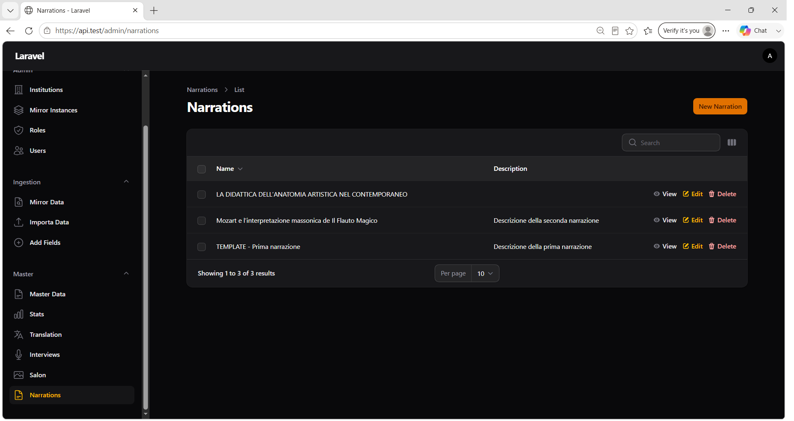

# Capitolo 8 — Narrations

## Obiettivo

Gestire le **narrazioni** (`iartnet_master.narrations`): contenuti editoriali con nome, descrizione e JSON esteso, tramite CRUD completo nel pannello Master.

## Quando usarlo

- Creazione di una nuova narrazione per il frontend o API pubbliche.
- Aggiornamento testi o struttura JSON (`ext_json`) di una narrazione esistente.
- Consultazione elenco narrazioni o eliminazione record obsoleti.

## Prerequisiti

- Accesso a **Master → Narrations** (admin, operatore o partner con sezioni operative).
- Per integrazione frontend/API: endpoint pubblici `/api/narrationsList` e `/api/narrationData` (nessuna autenticazione).

> **Differenza rispetto a Interviews:** le Narrations si creano con **Create** standard; non esiste un wizard di import da file.

---

## 8.1 Elenco Narrations

**Menu:** `Master` → **Narrations**



*Figura 8.1 — Tabella narrazioni con pulsante Create e azioni riga.*

### Colonne tabella

| Colonna | Descrizione |
|---------|-------------|
| **Name** | Nome narrazione (ricercabile, ordinabile) |
| **Description** | Descrizione breve (max 80 caratteri visibili, testo completo in tooltip se troncato) |
| **Created at** / **Updated at** | Timestamp (nascosti di default) |

Ordinamento predefinito: **Updated at** decrescente.

### Azioni header

| Pulsante | Azione |
|----------|--------|
| **Create** | Apre il form di creazione |

### Azioni riga

| Azione | Descrizione |
|--------|-------------|
| **View** | Dettaglio sola lettura |
| **Edit** | Modifica campi |
| **Delete** | Elimina la narrazione (con conferma Filament) |

**Bulk delete:** elimina le narrazioni selezionate.

---

## 8.2 Creazione (Create)

**Percorso:** `Master` → **Narrations** → **Create**

### Campi form

| Campo | Obbligatorio | Note |
|-------|--------------|------|
| **Name** | Sì | Max 255 caratteri |
| **Description** | No | Area di testo (5 righe) |
| **Ext JSON** | No | JSON libero; default visualizzato `{}` se vuoto |

#### Helper Ext JSON

> *JSON libero. Visualizzazione formattata: modifica direttamente il testo (sintassi JSON valida).*

Il campo accetta solo JSON sintatticamente valido (regola `ValidJson`). In salvataggio, JSON vuoto diventa `{}`.

### Esito atteso

La narrazione compare nell'elenco e risulta disponibile via API se esposta dal frontend.

---

## 8.3 Dettaglio (View)

**Percorso:** elenco → **View** su una riga

Mostra gli stessi campi del form in sola lettura. Azione header disponibile: **Edit**.

---

## 8.4 Modifica (Edit)

**Percorso:** elenco → **Edit**, oppure **View** → **Edit**

Stessi campi della creazione. Salvataggio aggiorna `updated_at`.

### Story Editor (wizard ext_json)

**Percorso:** `Edit` → pulsante header **Story Editor**

Apre una pagina dedicata a schermo intero con il wizard **Stories Editor** (SPA React) integrato via iframe. Il contenuto strutturato della story viene salvato in `ext_json`.

| Azione | Descrizione |
|--------|-------------|
| **Story Editor** | Apre `/admin/narrations/{id}/story-editor` |
| **Salva nella narrazione** | Nell'editor: invia `ext_json` al backend (senza download file) |
| **Torna alla narrazione** | Torna al form Filament standard |

**Flusso consigliato in creazione:** salvare prima la narrazione (per ottenere l'UUID e la cartella media), poi aprire **Story Editor** da **Edit**.

Il campo **Ext JSON** nel form Filament resta disponibile come fallback per modifiche manuali o debug.

**Build asset editor (sviluppo/deploy):** dalla cartella `apps/api`:

```bash
npm run build:stories-editor
```

Output statico in `public/stories-editor/` (nessun server Node dedicato in produzione).

---

## 8.5 Eliminazione

**Delete** (singola o bulk) rimuove la riga da `narrations`.

A differenza delle **Interviews**, l'eliminazione di una Narration **non** cancella schede Master collegate: le narrazioni sono entità autonome, non legate a un `record_id` obbligatorio nel flusso Filament documentato.

---

## 8.6 API pubbliche (riferimento operativo)

Le narrazioni pubblicate nel database sono esposte senza autenticazione:

| Endpoint | Uso |
|----------|-----|
| `GET /api/narrationsList` | Elenco narrazioni |
| `GET /api/narrationData` | Dettaglio singola narrazione (parametri query secondo implementazione controller) |

Per verificare l'esposizione frontend dopo create/edit: controllare la risposta API o il sito pubblico configurato.

---

## Checklist Narrations

- [ ] **Name** compilato e univoco nel contesto editoriale
- [ ] **Ext JSON** valido (se usato dal frontend)
- [ ] (Opzionale) Story strutturata via **Story Editor** e salvata con **Salva nella narrazione**
- [ ] Record visibile in elenco **Narrations**
- [ ] (Se applicabile) Narrazione raggiungibile via API pubblica

## Riferimenti

- [Capitolo 4 — Gestione Master Data](04-gestione-master.md)
- [Capitolo 5 — Translation](05-translation.md)
- [Capitolo 6 — Interviews](06-interviews.md)
- [Capitolo 7 — Salon](07-salon.md)
- [Indice manuale](README.md)
